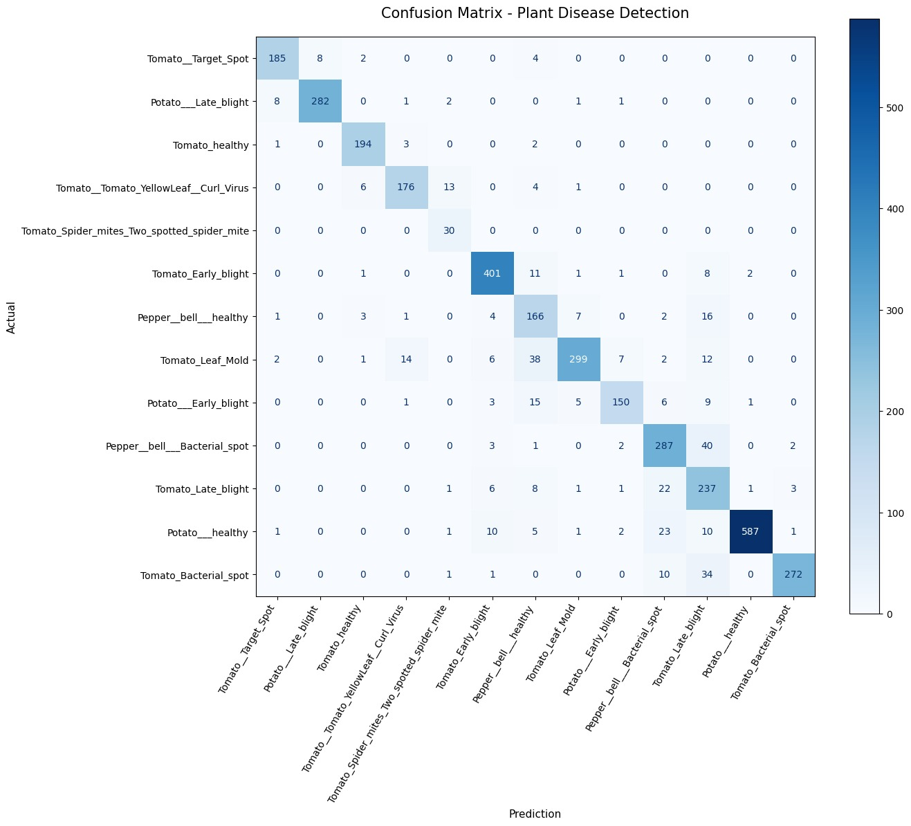

# 🌿 Plant Disease Detection using MobileNetV2

A deep learning-based image classification project that detects plant diseases from leaf images using **Transfer Learning** with **MobileNetV2**. The model is trained on the **PlantVillage** dataset and classifies images into **13 different disease categories**.

---
## 🔗 Live Link
👉 [Try the app here](https://plant-disease-detection-using-cnn-92dwkqvghzn5qvmeb8iu93.streamlit.app)

---

## 📖 Overview

Early detection of plant diseases helps farmers reduce crop losses and improve agricultural productivity. This project uses a pre-trained MobileNetV2 model to automatically identify diseases from leaf images with high accuracy.

---

## ✨ Features

- 🌱 Detects **13 plant disease classes**
- 🧠 Transfer Learning using **MobileNetV2**
- 📊 Data preprocessing and visualization
- 📈 Model training and evaluation
- 📉 Confusion Matrix and overall 91% accuracy
- 💻 Developed using **Google Colab**

---

## 🛠️ Tech Stack

- Python
- TensorFlow
- Keras
- MobileNetV2
- NumPy
- Pandas
- OpenCV
- Matplotlib
- Pillow (PIL)
- Scikit-learn
- Streamlit

---

## 📂 Dataset

**Dataset:** PlantVillage

The dataset contains labeled images of healthy and diseased plant leaves.

> **Note:** The dataset is not included in this repository because of its large size.

Dataset Link:
https://www.kaggle.com/datasets/emmarex/plantdisease

---

## 📁 Project Structure

```
Plant-Disease-Detection-Using-CNN/
│── Plant_disease_detection(1).ipynb
|__app(2).py
│── requirements.txt
│── README.md
│── PlantVillage.keras
│── classes.json
│── images/
│     ├── Confusion_Matrix.jpeg
│     ├── Project_Banner.jpeg
```

---

## 🧠 Model Architecture

- MobileNetV2 (Pre-trained)
- Global Average Pooling Layer
- Dense Layer
- Dropout Layer
- Softmax Output Layer

---

## 📊 Model Performance

### Confusion Matrix

The confusion matrix demonstrates that the model correctly classifies most leaf images, with only a few misclassifications between visually similar diseases.

<p align="center">
  
</p>

---

## 🚀 Installation

Clone the repository

```bash
git clone https://github.com/AashiSrivastava411/Plant-Disease-Detection-Using-CNN.git
```

Move into the project directory

```bash
cd Plant-Disease-Detection-Using-CNN
```

Install the required libraries

```bash
pip install -r requirements.txt
```

Run the notebook using **Google Colab** or **Jupyter Notebook**.

---

## 📌 Disease Classes

- Tomato Target Spot
- Potato Late Blight
- Tomato Healthy
- Tomato Yellow Leaf Curl Virus
- Tomato Spider Mites
- Tomato Early Blight
- Bell Pepper Healthy
- Tomato Leaf Mold
- Potato Early Blight
- Bell Pepper Bacterial Spot
- Tomato Late Blight
- Potato Healthy
- Tomato Bacterial Spot

---

## 📈 Future Improvements

- Add Grad-CAM visualization
- Increase dataset diversity
- Improve performance with hyperparameter tuning
- Convert the model to TensorFlow Lite for mobile applications

---

## 🤝 Contributing

Contributions are welcome!

Feel free to fork this repository, create a new branch, and submit a pull request.

---

## 👨‍💻 Author

**Aashi Srivastava**

GitHub: https://github.com/AashiSrivastava411

---

## ⭐ Support

If you found this project helpful, please consider giving it a ⭐ on GitHub.
